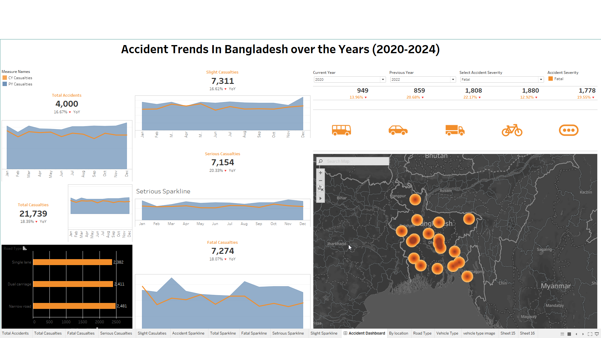

# Accident Trends in Bangladesh

This project analyzes accident trends from 2020 to 2024 in Bangladesh using Tableau dashboards.  

## Dataset Description
This dataset is a simulated record of road accidents in Bangladesh from 2020 to 2024, created for the purpose of building a Tableau dashboard.
It contains randomly generated accident data that reflects realistic trends — including an overall increase in accident numbers over the years and varying distribution across major districts.

Each record includes details such as accident severity, date, location (latitude and longitude generated around district centroids with small random variation), light conditions, number of casualties, number of vehicles involved, type of vehicles, road surface conditions, road type, and whether the accident occurred in an urban or rural area.

While the data is not sourced from actual reports, it has been designed to mimic plausible real-world patterns, allowing for the creation of interactive maps, KPIs, and analytical visualizations without using sensitive or proprietary information.

Tableau workbook [here](https://public.tableau.com/app/profile/nusrat.jahan.farin/viz/AccidenttrendsinBangladesh/AccidentDashboard)
