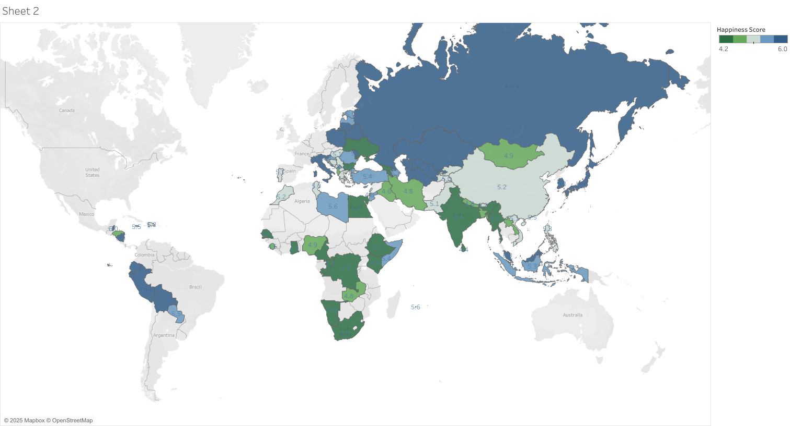

# World Happiness Project

This Tableau dashboard visualizes the World Happiness scores across various countries, highlighting global trends and regional insights.

## Dataset Description

- This project was completed as part of the **Google Data Analytics Certificate** program.
- The dataset used is from [Just the Data - World Happiness](https://www.kaggle.com/datasets/google/world-happiness), provided by **Google Career Certificates**.
- It contains global happiness scores based on various factors such as GDP per capita, social support, healthy life expectancy, and perceptions of corruption.

The dashboard provides an intuitive geographic view of happiness scores to explore disparities and patterns worldwide.

View the Tableau dashboard [here](https://public.tableau.com/app/profile/nusrat.jahan.farin/viz/MyWorldHappinessProject_16916556456060/Sheet2)

