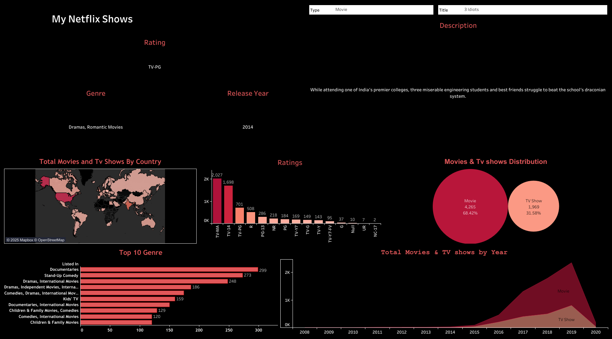

# Netflix Shows Analysis

This Tableau dashboard provides an overview of various movies and TV shows available on Netflix.

## Dataset Description

- The dataset was curated from online sources for practice/demo purposes.
- It includes details like title, genre, release year, rating, country of origin, and descriptions of movies and TV shows.
- This dataset is used to explore patterns and trends in Netflix's content library, such as distribution by genre, ratings, and release year.

Tableau workbook [here](https://public.tableau.com/app/profile/nusrat.jahan.farin/viz/MyNetflixShows/Netflix)
